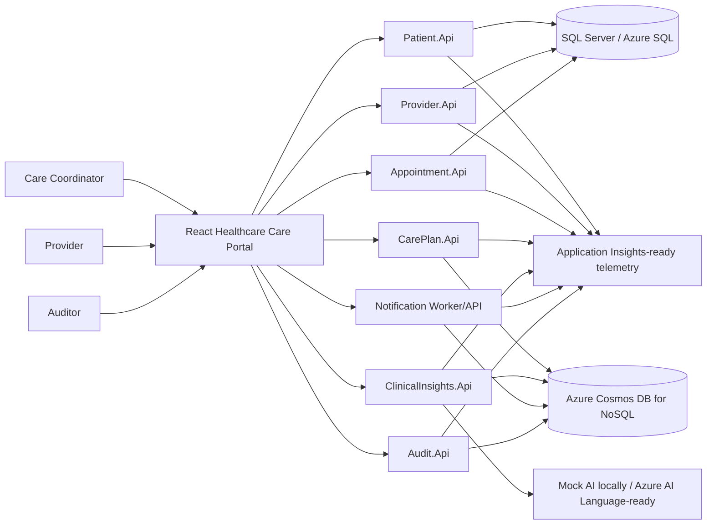

# Healthcare Care Coordination System

Healthcare Care Coordination System is a cloud-native healthcare platform demo built with .NET, React, SQL Server, Azure Cosmos DB, and Azure AI Language readiness. It demonstrates patient management, provider coordination, appointment scheduling, care plan workflows, clinical note insight analysis, follow-up task tracking, notification simulation, audit logging, RBAC readiness, observability, Docker-based local development, and Azure deployment architecture.

This repository is a portfolio demonstration project. It uses synthetic healthcare data only. It is not a production medical system, does not provide medical advice, does not claim HIPAA compliance, and is not clinically certified.

## Architecture Summary

The system models a simplified healthcare coordination journey across domain-oriented service boundaries:

- React + TypeScript care operations portal under `src/web/healthcare-care-portal`.
- ASP.NET Core APIs for patient, provider, appointment, care plan, clinical insight, notification, and audit capabilities.
- SQL Server locally and Azure SQL by design for transactional patient, provider, and appointment data.
- Azure Cosmos DB-ready repositories for care plans, clinical insights, notifications, audit events, and follow-up workflow documents.
- `MockClinicalTextAnalyzer` as the local default with optional `AzureTextAnalyticsForHealthProvider` readiness.
- Correlation IDs, Problem Details, structured logging, health checks, OpenTelemetry, and Application Insights readiness.
- Demo RBAC via `X-Demo-User-Role` for portfolio review, with Azure Entra ID direction documented.



## Business Problem

Care coordination requires multiple roles to work from a shared operational picture: patient profile readiness, provider availability, appointments, care plans, follow-up tasks, clinical note review, notifications, and audit trails. The demo shows how those concerns can be separated into maintainable service boundaries while preserving traceability, privacy constraints, and Azure deployment readiness.

## Key Capabilities

| Capability | Current implementation |
|---|---|
| Patient registration | SQL-backed patient API, validation, React registration and detail screens |
| Provider management | SQL-backed provider API, specialty and availability modeling |
| Appointment scheduling | SQL-backed scheduling API with appointment status transitions |
| Care plans | Cosmos DB-ready document model with goals and tasks |
| Follow-up tasks | Task status, priority, due-date, overdue, and due-today views |
| Clinical insights | Synthetic note analysis through mock AI, optional Azure AI Language provider readiness |
| Notifications | Simulated email, SMS, and portal notification workflow |
| Audit logging | Cosmos DB-ready safe audit event capture and query APIs |
| Security/RBAC | Demo role model with future Azure Entra ID and JWT direction |
| Observability | Correlation ID middleware, structured logging, health endpoints, telemetry readiness |
| DevOps | Docker Compose, multi-stage Dockerfiles, CI workflow, Bicep deployment blueprint |

## Technology Stack

- Backend: .NET 8, ASP.NET Core minimal APIs, C#, Entity Framework Core, FluentValidation-style validators, Problem Details.
- Frontend: React, TypeScript, Vite, React Router, TanStack Query, React Hook Form, Zod, Axios.
- Persistence: SQL Server / Azure SQL for transactional modules; Azure Cosmos DB-ready repositories for document and event modules.
- AI readiness: Mock local provider and optional Azure AI Language Text Analytics for Health provider.
- Observability: Serilog-style structured logging, OpenTelemetry readiness, Application Insights, Log Analytics.
- Azure target: Static Web Apps, Container Apps, Container Registry, Azure SQL, Cosmos DB, Key Vault, Service Bus readiness.
- DevOps: Docker, Docker Compose, GitHub Actions, Bicep.

## Module Overview

| Module | Responsibility | Storage direction |
|---|---|---|
| `Patient.Api` | Patient profile, contact data, emergency contact, consent status | SQL Server / Azure SQL |
| `Provider.Api` | Provider profile, specialty, department, availability | SQL Server / Azure SQL |
| `Appointment.Api` | Appointment scheduling and status lifecycle | SQL Server / Azure SQL |
| `CarePlan.Api` | Care plan documents, goals, instructions, follow-up tasks | Azure Cosmos DB |
| `ClinicalInsights.Api` | Synthetic clinical note insight generation and review status | Azure Cosmos DB |
| `Notification.Worker` | Simulated notification request and delivery history | Cosmos DB / Service Bus-ready |
| `Audit.Api` | Safe audit event recording and traceability queries | Azure Cosmos DB |
| `healthcare-care-portal` | Healthcare operations portal for portfolio demonstration | Browser client |

## Data Architecture

The repository intentionally demonstrates polyglot persistence:

- SQL Server owns structured transactional data that benefits from relational integrity: patients, providers, appointments.
- Cosmos DB owns flexible coordination documents and event-style history: care plans, clinical insights, notifications, audit events.
- Audit metadata is intentionally minimal and must not contain full clinical notes or sensitive health details.
- All sample data is synthetic demo data.

See [architecture/polyglot-persistence.md](architecture/polyglot-persistence.md) and [architecture/data-model.md](architecture/data-model.md).

## Azure AI Language Readiness

Clinical insights are implemented behind an abstraction:

- Local and CI default: `MockClinicalTextAnalyzer`.
- Optional Azure-ready provider: `AzureTextAnalyticsForHealthProvider`.
- Configuration is environment-driven and must not require Azure credentials for local development.
- Output is informational demo output requiring qualified healthcare professional review.
- The application must not present extracted terms as diagnosis, medical advice, or clinical decision support.

See [architecture/clinical-ai-architecture.md](architecture/clinical-ai-architecture.md) and [docs/azure-ai-language-readiness.md](docs/azure-ai-language-readiness.md).

## Security And Privacy Readiness

The project demonstrates compliance-readiness patterns, not certified compliance:

- Synthetic demo data only.
- No real patient data, clinical notes, provider data, hospital data, or client data.
- No committed `.env` files, tokens, client secrets, Azure keys, Cosmos keys, or production connection strings.
- Demo RBAC roles: `Patient`, `Provider`, `CareCoordinator`, `Admin`, `Auditor`.
- Future authentication direction: Azure Entra ID, JWT validation, role-based authorization policies.
- Safe logging guidance prohibits secrets, full clinical notes, full patient addresses, and sensitive notification bodies.

See [architecture/security-architecture.md](architecture/security-architecture.md), [architecture/privacy-and-compliance.md](architecture/privacy-and-compliance.md), and [docs/security-and-rbac-readiness.md](docs/security-and-rbac-readiness.md).

## Observability Readiness

Each backend service exposes:

- `GET /health/live` for process liveness.
- `GET /health/ready` for dependency readiness.
- `GET /health` as a readiness alias.

The APIs propagate `X-Correlation-ID` through responses and logs. The React portal includes a `/system-health` dashboard for service readiness checks.

See [architecture/observability-architecture.md](architecture/observability-architecture.md) and [docs/application-insights-readiness.md](docs/application-insights-readiness.md).

## Azure Deployment Blueprint

The Azure blueprint uses Bicep under `infra/bicep/` and documents:

- Azure Static Web Apps for the React portal.
- Azure Container Apps for backend APIs and worker services.
- Azure Container Registry for container images.
- Azure SQL Database for transactional data.
- Azure Cosmos DB for documents and events.
- Azure AI Language readiness for Text Analytics for Health.
- Azure Service Bus readiness for asynchronous workflow events.
- Azure Key Vault and managed identity for secrets.
- Application Insights and Log Analytics for telemetry.

See [architecture/deployment-architecture.md](architecture/deployment-architecture.md), [infra/bicep/README.md](infra/bicep/README.md), and [docs/azure-deployment-guide.md](docs/azure-deployment-guide.md).

## Local Development

Prerequisites:

- .NET 8 SDK
- Node.js 20 or later
- Docker Desktop
- npm

Create local configuration:

```powershell
Copy-Item .env.example .env
```

Run the full local stack:

```powershell
docker compose up --build -d
```

Run the frontend only:

```powershell
cd src/web/healthcare-care-portal
npm install
npm run dev
```

Run an API service directly:

```powershell
dotnet run --project src/services/Patient.Api/Patient.Api.csproj
```

Open API documentation:

- Patient API: `http://localhost:5080/swagger`
- Provider API: `http://localhost:5081/swagger`
- Appointment API: `http://localhost:5082/swagger`
- Care Plan API: `http://localhost:5083/swagger`
- Clinical Insights API: `http://localhost:5084/swagger`
- Audit API: `http://localhost:5085/swagger`
- Portal: `http://localhost:5173`

## Build And Test

Backend:

```powershell
Get-ChildItem -Recurse -Filter *.csproj src | ForEach-Object { dotnet build $_.FullName }
Get-ChildItem -Recurse -Filter *.csproj tests | ForEach-Object { dotnet test $_.FullName }
```

Frontend:

```powershell
cd src/web/healthcare-care-portal
npm install
npm run build
npm test
```

Docker validation:

```powershell
docker compose config
docker compose build patient-api portal
```

## Repository Structure

```text
healthcare-care-coordination-system/
├── architecture/               Architecture views, diagrams, and ADRs
├── docs/                       Setup, operations, security, AI, DevOps, and roadmap docs
├── infra/bicep/                Azure deployment blueprint
├── samples/                    Synthetic sample payloads only
├── src/building-blocks/        Shared kernel, observability, security, compliance, AI, Cosmos, messaging
├── src/services/               ASP.NET Core service boundaries
├── src/web/healthcare-care-portal/
├── tests/                      Backend test projects by boundary
├── docker-compose.yml
└── .github/workflows/
```

## Screenshots

Add current screenshots under `docs/screenshots/` before publishing the repository:

| Screen | Suggested file |
|---|---|
| Dashboard command center | `docs/screenshots/dashboard.png` |
| Patient registration | `docs/screenshots/patient-registration.png` |
| Appointment scheduling | `docs/screenshots/appointment-scheduling.png` |
| Care plan workspace | `docs/screenshots/care-plan-workspace.png` |
| Clinical insights review | `docs/screenshots/clinical-insights.png` |
| Audit trail | `docs/screenshots/audit-trail.png` |
| System health | `docs/screenshots/system-health.png` |

## Roadmap

Completed MVP capabilities:

- Patient Registration
- Provider Management
- Appointment Scheduling
- Care Plan Management with Cosmos DB-ready persistence
- Clinical Note Insights with Mock AI Provider
- Azure AI Language Provider Readiness
- Follow-up Task Tracking
- Notification Simulation
- Audit Logging with Cosmos DB-ready persistence
- Security, Privacy, and RBAC Readiness
- Observability and Production Readiness
- DevOps and Docker
- Azure Deployment Blueprint
- Portfolio Polish

Future improvements:

- Real Azure AI Language integration in a controlled non-production environment.
- Azure Entra ID authentication and full JWT authorization policies.
- Azure API Management gateway.
- Real Azure Service Bus eventing.
- Advanced role-based workflows.
- Production deployment pipeline with environment approvals.
- Application Insights dashboards and alert rules.
- Automated integration and synthetic E2E testing.
- Accessibility and keyboard navigation improvements.

## Portfolio Value

This project demonstrates Solution Architect capability across healthcare workflow modeling, .NET API architecture, React frontend architecture, SQL Server and Cosmos DB data ownership, Azure AI Language readiness, responsible AI and human-review-first design, security and privacy architecture, audit logging, observability, Docker, CI/CD, and Azure cloud deployment planning.

