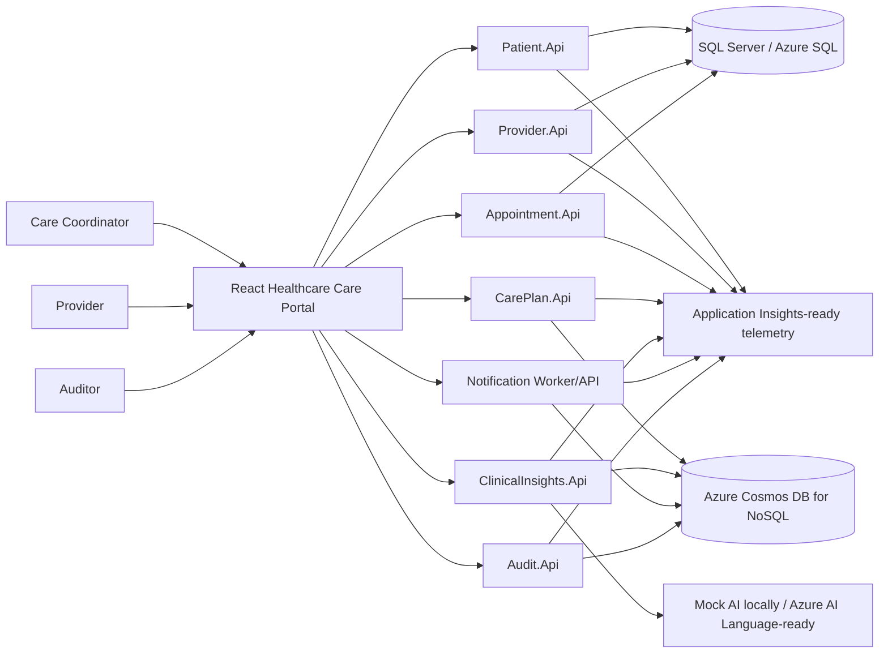

# Healthcare Care Coordination System

Cloud-native healthcare care coordination platform demo built with .NET, React, SQL Server, Azure Cosmos DB, Azure AI Language readiness, RBAC, audit logging, observability, Docker, and Azure deployment architecture.

## Why This Project Matters for Solution Architecture

This repository is designed as a public Solution Architect portfolio project, not a simple CRUD demo. It demonstrates:

- Healthcare workflow modeling across patients, providers, appointments, care plans, clinical insights, follow-up tasks, notifications, and audit events.
- .NET API and service boundary design with domain-oriented modules.
- React frontend architecture for a healthcare operations portal.
- SQL Server and Azure Cosmos DB polyglot persistence decisions.
- Azure AI Language readiness with responsible AI safeguards and human-review-first design.
- RBAC readiness, safe audit logging, privacy-aware data handling, and traceability.
- Observability, health checks, Docker, GitHub Actions, Bicep, and Azure deployment planning.

## Important Disclaimer

This repository is a portfolio demonstration project. It uses synthetic healthcare data only. It is not a production medical system, does not provide medical advice, does not claim HIPAA compliance, and is not clinically certified.

## Business Problem

Healthcare care coordination requires multiple roles to work from a shared operational picture: patient profile readiness, provider availability, appointment scheduling, care plans, follow-up tasks, clinical note review, notifications, and audit trails. The project demonstrates how those concerns can be modeled with clear service boundaries, safe data handling, auditability, and Azure-ready deployment architecture.

## Solution Overview

The system models a simplified healthcare coordination journey through a React care portal and domain-oriented ASP.NET Core services. Transactional master data is represented with SQL Server / Azure SQL direction, while flexible coordination documents and event-style records are represented through Azure Cosmos DB-ready repositories. Clinical insights use a mock AI provider locally and remain Azure AI Language-ready without requiring Azure credentials for development or CI.

## Key Capabilities

| Capability | Current implementation |
|---|---|
| Patient Registration | SQL-backed patient API, validation, React registration/list/detail screens |
| Provider Management | SQL-backed provider API, specialty, department, and availability modeling |
| Appointment Scheduling | SQL-backed scheduling API with appointment status transitions |
| Care Plan Management | Cosmos DB-ready document model with goals, instructions, and tasks |
| Clinical Note Insights | Synthetic note analysis through mock AI with human review workflow |
| Azure AI Language Provider Readiness | Optional provider abstraction for Text Analytics for Health readiness |
| Follow-up Task Tracking | Task status, priority, due-date, overdue, and due-today views |
| Notification Simulation | Simulated email, SMS, and portal notification workflow |
| Audit Logging | Cosmos DB-ready safe audit event capture and query APIs |
| Security, Privacy, and RBAC Readiness | Demo role model with future Azure Entra ID and JWT direction |
| Observability and System Health | Correlation IDs, structured logging, health endpoints, telemetry readiness |
| Azure Deployment Blueprint | Bicep, Container Apps, Static Web Apps, Azure SQL, Cosmos DB, Key Vault, Application Insights |

## Technology Stack

Backend:

- .NET 10
- ASP.NET Core Web API / Minimal APIs
- Entity Framework Core
- SQL Server / Azure SQL
- Cosmos DB-ready repository abstractions
- Swagger / OpenAPI
- Serilog / structured logging readiness
- Health checks
- Problem Details
- Docker

Frontend:

- React
- TypeScript
- Vite
- React Router
- React Hook Form
- Zod
- TanStack Query
- Axios

Cloud and DevOps:

- Azure Container Apps
- Azure Static Web Apps
- Azure SQL Database
- Azure Cosmos DB
- Azure AI Language readiness
- Azure Key Vault
- Azure Application Insights
- Azure Log Analytics
- Azure Service Bus readiness
- Docker Compose
- GitHub Actions
- Bicep

### Running Tests (Local Validation)

```bash
# Backend (from repository root)
Get-ChildItem -Recurse -Filter *.csproj src | ForEach-Object { dotnet build $_.FullName }
Get-ChildItem -Recurse -Filter *.csproj tests | ForEach-Object { dotnet test $_.FullName }

# Frontend
cd src/web/healthcare-care-portal
npm ci
npm run build
npm test
```

## Architecture Overview

Key architecture views:

- [High-Level Design](architecture/hld.md)
- [Low-Level Design](architecture/lld.md)
- [API Governance](architecture/api-governance.md)
- [Data Model](architecture/data-model.md)
- [Event Model](architecture/event-model.md)
- [Polyglot Persistence](architecture/polyglot-persistence.md)
- [Clinical AI Architecture](architecture/clinical-ai-architecture.md)
- [Security Architecture](architecture/security-architecture.md)
- [Privacy and Compliance-Readiness](architecture/privacy-and-compliance.md)
- [Observability Architecture](architecture/observability-architecture.md)
- [Deployment Architecture](architecture/deployment-architecture.md)
- [Architecture Decision Records](architecture/adr/)

## System Diagram



Additional diagrams:

- [System Context](architecture/diagrams/system-context.md)
- [Container Diagram](architecture/diagrams/container-diagram.md)
- [Patient Appointment Flow](architecture/diagrams/patient-appointment-flow.md)
- [Care Plan Flow](architecture/diagrams/care-plan-flow.md)
- [Clinical Insights Flow](architecture/diagrams/clinical-insights-flow.md)
- [Audit Logging Flow](architecture/diagrams/audit-logging-flow.md)
- [Correlation ID Flow](architecture/diagrams/correlation-id-flow.md)
- [Azure Deployment](architecture/diagrams/azure-deployment.md)

## Module Overview

| Module | Responsibility | Storage direction |
|---|---|---|
| `Patient.Api` | Patient profile, contact data, emergency contact, consent status | SQL Server / Azure SQL |
| `Provider.Api` | Provider profile, specialty, department, availability | SQL Server / Azure SQL |
| `Appointment.Api` | Appointment scheduling and status lifecycle | SQL Server / Azure SQL |
| `CarePlan.Api` | Care plan documents, goals, instructions, follow-up tasks | Azure Cosmos DB |
| `ClinicalInsights.Api` | Synthetic clinical note insight generation and review status | Azure Cosmos DB |
| `Notification.Worker` | Simulated notification request and delivery history | Cosmos DB / Service Bus-ready |
| `Audit.Api` | Safe audit event recording and traceability queries | Azure Cosmos DB |
| `healthcare-care-portal` | Healthcare operations portal for portfolio demonstration | Browser client |

## Data Architecture

SQL Server / Azure SQL is used for structured transactional data:

- Patients
- Providers
- Appointments

Azure Cosmos DB is used for flexible healthcare documents and event-style data:

- Care Plans
- Clinical Insights
- Follow-up Tasks
- Notifications
- Audit Events

All data is synthetic demo data only. See [Polyglot Persistence](architecture/polyglot-persistence.md) and [Data Model](architecture/data-model.md).

## Azure AI Language Readiness

The Clinical Insights module uses an AI provider abstraction:

- `MockClinicalTextAnalyzer` is the default local and CI provider.
- `AzureTextAnalyticsForHealthProvider` is available as a configuration-ready provider.
- No Azure AI credentials are required for local development.
- No real clinical notes should be used.
- AI output is assistive demo output only.
- AI output requires human review.
- AI output is not medical advice, diagnosis, or a replacement for qualified healthcare professional judgment.

See [Clinical AI Architecture](architecture/clinical-ai-architecture.md) and [Azure AI Language Readiness](docs/azure-ai-language-readiness.md).

## Security, Privacy, and RBAC Readiness

The project demonstrates compliance-readiness patterns without claiming certified compliance:

- Synthetic data only.
- Demo RBAC roles: `Patient`, `Provider`, `CareCoordinator`, `Admin`, `Auditor`.
- Future Azure Entra ID and JWT authorization readiness.
- Safe logging policy: no secrets, full clinical notes, full addresses, or sensitive notification bodies.
- Safe audit metadata: no sensitive health details in audit records.
- `.env.example` uses placeholders; `.env` files are ignored.
- Key Vault and managed identity readiness are documented.
- No HIPAA compliance claim.
- No clinical certification claim.

See [Security Architecture](architecture/security-architecture.md), [Privacy and Compliance-Readiness](architecture/privacy-and-compliance.md), and [Security and RBAC Readiness](docs/security-and-rbac-readiness.md).

## Audit Logging and Traceability

Audit logging is modeled as append-style event history with safe metadata. Audit records support traceability by correlation ID, entity, event type, and source service. The audit design intentionally avoids full clinical note text and sensitive health details.

See [Audit Logging Strategy](docs/audit-logging-strategy.md) and [Audit Logging Flow](architecture/diagrams/audit-logging-flow.md).

## Observability and Production Readiness

Each backend service exposes:

- GET /health/live
- GET /health/ready
- GET /health

The APIs propagate X-Correlation-ID through responses and logs. The React portal includes a /system-health dashboard. Application Insights and Log Analytics readiness are documented but not required locally.

See [Observability Architecture](architecture/observability-architecture.md) and [Application Insights Readiness](docs/application-insights-readiness.md).

## DevOps and Docker

The repository includes:

- Multi-stage backend Dockerfile for service projects.
- React/Vite Dockerfile served through Nginx.
- Docker Compose for local orchestration.
- GitHub Actions CI for backend build/test, frontend type-check/build/test, and Docker build validation.
- Lockfile-based frontend installs through npm ci in CI and container builds.

Docker commands:

```powershell
docker compose up --build
docker compose config
docker compose down
```

See [Docker Guide](docs/docker-guide.md), [CI/CD Pipeline](docs/ci-cd.md), and [DevOps Guide](docs/devops-guide.md).

## Azure Deployment Blueprint

The Azure blueprint is under infra/bicep/ and includes:

- Azure Container Apps for backend APIs and worker services.
- Azure Static Web Apps for the React frontend.
- Azure SQL Database for transactional data.
- Azure Cosmos DB for documents and events.
- Azure AI Language readiness.
- Azure Key Vault for secrets.
- Azure Application Insights and Log Analytics for telemetry.
- Azure Service Bus readiness for event-driven workflows.
- GitHub Actions deployment workflow placeholders using OIDC and GitHub Secrets.

The blueprint does not include real credentials and must be configured separately for any Azure subscription.

See [Deployment Architecture](architecture/deployment-architecture.md), [Bicep README](infra/bicep/README.md), and [Azure Deployment Guide](docs/azure-deployment-guide.md).

## Demo Workflow

Recommended portfolio demo path:

1. Register a synthetic patient.
2. Register a synthetic provider.
3. Schedule an appointment.
4. Create a care plan.
5. Submit a synthetic clinical note.
6. Generate mock clinical insights.
7. Review the AI-assisted insight.
8. Create a follow-up task.
9. Simulate a notification.
10. View the audit trail.
11. Check system health.

## Local Development

Prerequisites:

- .NET 10 SDK
- Node.js 20 or later
- npm
- Docker Desktop

Create local configuration:

```powershell
Copy-Item .env.example .env
```

Run a backend API directly:

```powershell
dotnet run --project src/services/Patient.Api/Patient.Api.csproj
```

Run the frontend:

```powershell
cd src/web/healthcare-care-portal
npm install
npm run dev
```

Local default modes:

- `AI_PROVIDER=Mock`
- `CLINICAL_AI_PROVIDER_MODE=Mock`
- `COSMOS_MODE=Mock`
- `Security__Mode=Demo`

## Docker Setup

Run the local stack:

```powershell
docker compose up --build
```

Validate Compose:

```powershell
docker compose config
```

Stop the local stack:

```powershell
docker compose down
```

Portal: `http://localhost:5173`

## API Documentation

Swagger/OpenAPI endpoints when running through Docker Compose:

- Patient API: `http://localhost:5080/swagger`
- Provider API: `http://localhost:5081/swagger`
- Appointment API: `http://localhost:5082/swagger`
- Care Plan API: `http://localhost:5083/swagger`
- Clinical Insights API: `http://localhost:5084/swagger`
- Audit API: `http://localhost:5085/swagger`

See [API Contracts](docs/api-contracts.md).

## Testing

Backend:

```powershell
Get-ChildItem -Recurse -Filter *.csproj src | ForEach-Object { dotnet build $_.FullName }
Get-ChildItem -Recurse -Filter *.csproj tests | ForEach-Object { dotnet test $_.FullName }
```

Frontend:

```powershell
cd src/web/healthcare-care-portal
npm ci
npm run build
npm test
```

Audit frontend dependencies:

```powershell
cd src/web/healthcare-care-portal
npm audit
```

## Repository Structure

```text
healthcare-care-coordination-system/
|-- architecture/               Architecture views, diagrams, and ADRs
|-- docs/                       Setup, operations, security, AI, DevOps, and roadmap docs
|-- docs/screenshots/           Screenshot capture guidance and future images
|-- infra/bicep/                Azure deployment blueprint
|-- samples/                    Synthetic sample payloads only
|-- src/building-blocks/        Shared kernel, observability, security, compliance, AI, Cosmos, messaging
|-- src/services/               ASP.NET Core service boundaries
|-- src/web/healthcare-care-portal/
|-- tests/                      Backend test projects by boundary
|-- docker-compose.yml
|-- Makefile
`-- .github/workflows/
```

## Screenshots

Screenshot guidance is documented in [docs/screenshots/README.md](docs/screenshots/README.md).

Suggested screenshot placeholders:

- `docs/screenshots/dashboard.png`
- `docs/screenshots/patient-list.png`
- `docs/screenshots/appointment-scheduling.png`
- `docs/screenshots/care-plan-details.png`
- `docs/screenshots/clinical-insights.png`
- `docs/screenshots/follow-up-tasks.png`
- `docs/screenshots/notification-simulation.png`
- `docs/screenshots/audit-log.png`
- `docs/screenshots/system-health.png`
- [Azure deployment diagram](architecture/diagrams/azure-deployment.md)

Do not add fake binary screenshots. Add real captures only after running the portal locally.

## Roadmap

Completed capabilities:

- Patient Registration
- Provider Management
- Appointment Scheduling
- Care Plan Management with Cosmos DB-ready persistence
- Clinical Note Insights with Mock AI Provider
- Azure AI Language Provider Readiness
- Follow-up Task Tracking
- Notification Simulation
- Audit Logging with Cosmos DB-ready persistence
- Security, Privacy, and RBAC Readiness
- Observability and Production Readiness
- DevOps and Docker
- Azure Deployment Blueprint
- Portfolio Polish
- Final QA
- Security and Responsible AI Review
- GitHub Publishing Readiness

Future improvements:

- Real Azure AI Language integration in a controlled non-production environment.
- Azure Entra ID authentication.
- Real Azure Cosmos DB deployment.
- Real Azure Service Bus eventing.
- Azure API Management gateway.
- Advanced role workflows.
- Real dashboards in Azure Monitor.
- E2E testing.
- Accessibility improvements.
- Deployment to a live Azure environment.

See [Roadmap](docs/roadmap.md).

## Known Limitations

- Uses synthetic data only.
- Not a production medical system.
- Does not provide medical advice.
- Does not claim HIPAA compliance.
- Mock AI provider is default locally.
- Azure AI integration is readiness-focused unless configured.
- Notification module simulates delivery only.
- Azure deployment files are blueprint-level unless deployed separately.
- Security model is demo/readiness-oriented, not production identity.
- Test coverage is portfolio/MVP oriented and should be expanded before any production-style use.

## GitHub Topics Recommendation

Recommended repository name:

```text
healthcare-care-coordination-system
```

Recommended repository description:

```text
Cloud-native healthcare care coordination platform demo built with .NET, React, SQL Server, Cosmos DB, Azure AI Language readiness, RBAC, audit logging, observability, Docker, and Azure deployment architecture.
```

Recommended topics:

```text
dotnet
react
typescript
azure
healthcare
cosmos-db
sql-server
azure-ai
azure-ai-language
microservices
clean-architecture
rbac
audit-logging
observability
docker
bicep
azure-container-apps
solution-architecture
portfolio-project
responsible-ai
```

## License

This project is licensed under the [MIT License](LICENSE).
