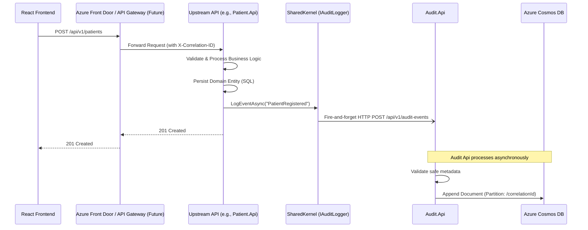

```mermaid
sequenceDiagram
    participant UI as React Frontend
    participant Gateway as Azure Front Door / API Gateway (Future)
    participant Upstream as Upstream API (e.g., Patient.Api)
    participant Shared as SharedKernel (IAuditLogger)
    participant AuditAPI as Audit.Api
    participant Cosmos as Azure Cosmos DB

    UI->>Gateway: POST /api/v1/patients
    Gateway->>Upstream: Forward Request (with X-Correlation-ID)
    
    Upstream->>Upstream: Validate & Process Business Logic
    Upstream->>Upstream: Persist Domain Entity (SQL)
    
    Upstream->>Shared: LogEventAsync("PatientRegistered")
    Shared-)AuditAPI: Fire-and-forget HTTP POST /api/v1/audit-events
    
    Upstream-->>Gateway: 201 Created
    Gateway-->>UI: 201 Created

    Note over AuditAPI,Cosmos: Audit Api processes asynchronously
    AuditAPI->>AuditAPI: Validate safe metadata
    AuditAPI->>Cosmos: Append Document (Partition: /correlationId)
```
