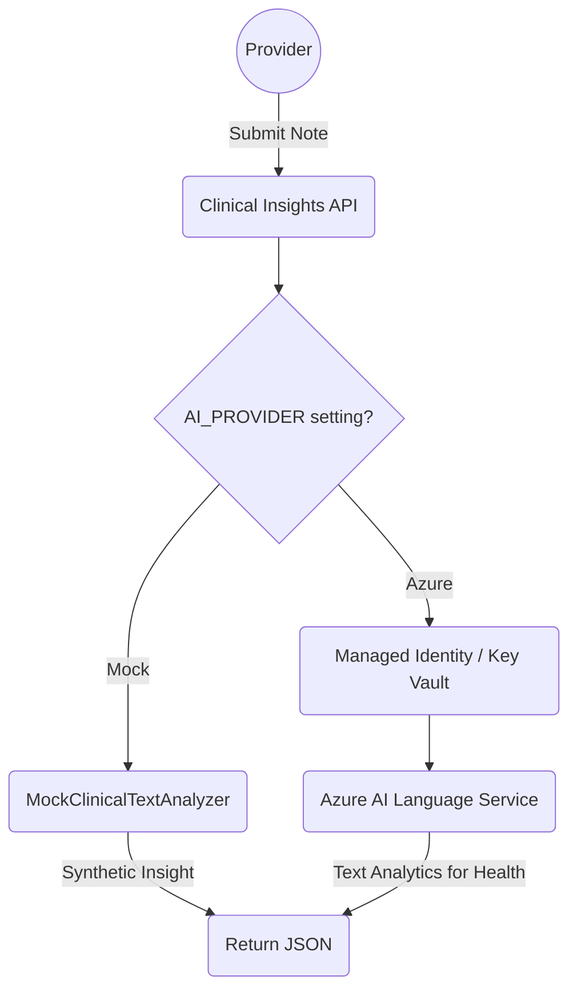

# Azure AI Language Flow

```mermaid
graph TD
    User((Provider)) -->|Submit Note| ClinAPI(Clinical Insights API)
    
    ClinAPI --> Config{AI_PROVIDER setting?}
    
    Config -->|Mock| MockProvider(MockClinicalTextAnalyzer)
    MockProvider -->|Synthetic Insight| Output(Return JSON)
    
    Config -->|Azure| Auth(Managed Identity / Key Vault)
    Auth --> AzureAI(Azure AI Language Service)
    AzureAI -->|Text Analytics for Health| Output
```
