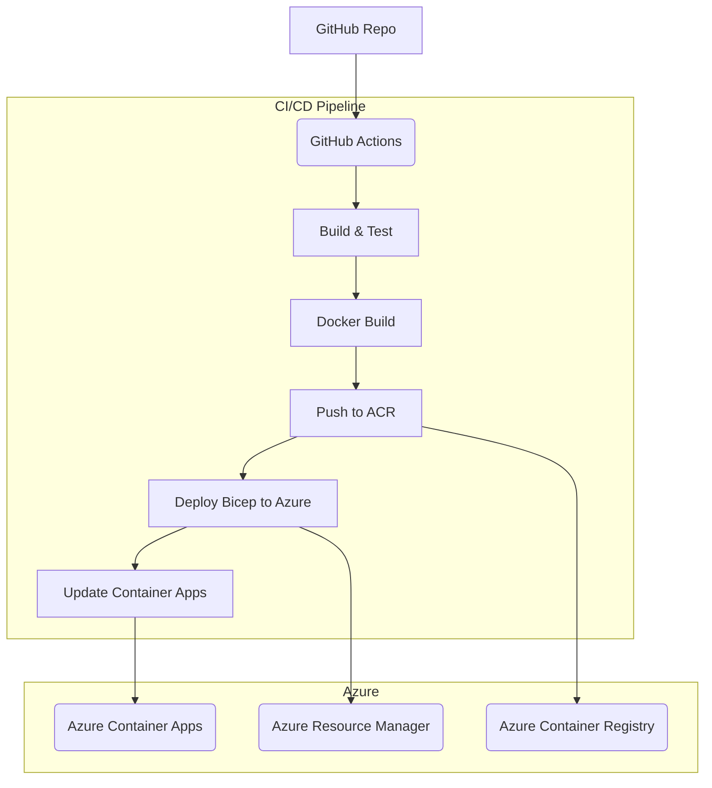

# Azure CI/CD Flow

```mermaid
flowchart TD
    Git[GitHub Repo] --> Action(GitHub Actions)
    
    subgraph "CI/CD Pipeline"
        Action --> Build[Build & Test]
        Build --> Docker[Docker Build]
        Docker --> PushACR[Push to ACR]
        PushACR --> DeployBicep[Deploy Bicep to Azure]
        DeployBicep --> UpdateACA[Update Container Apps]
    end
    
    subgraph "Azure"
        DeployBicep --> ARM(Azure Resource Manager)
        PushACR --> ACR(Azure Container Registry)
        UpdateACA --> ACA(Azure Container Apps)
    end
```
