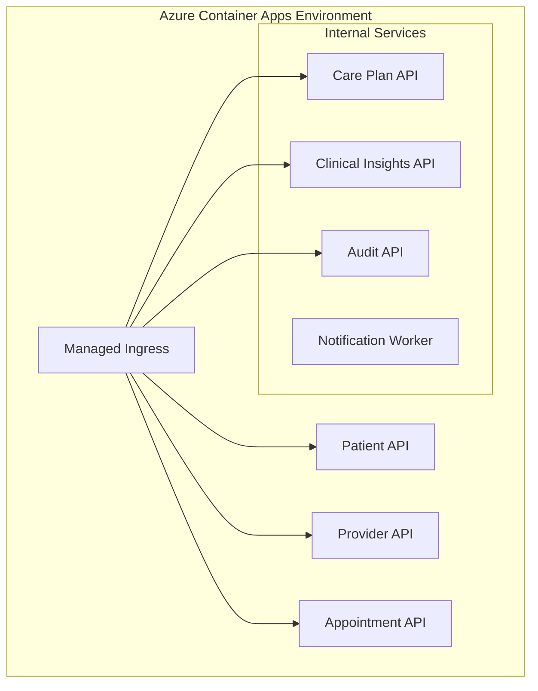

# Azure Container Apps Flow

```mermaid
graph TD
    subgraph "Azure Container Apps Environment"
        Ingress[Managed Ingress]
        
        PatAPI[Patient API]
        ProvAPI[Provider API]
        ApptAPI[Appointment API]
        
        Ingress --> PatAPI
        Ingress --> ProvAPI
        Ingress --> ApptAPI
        
        subgraph "Internal Services"
            CareAPI[Care Plan API]
            ClinAPI[Clinical Insights API]
            AudAPI[Audit API]
            NotWorker[Notification Worker]
        end
        
        Ingress --> CareAPI
        Ingress --> ClinAPI
        Ingress --> AudAPI
    end
```
