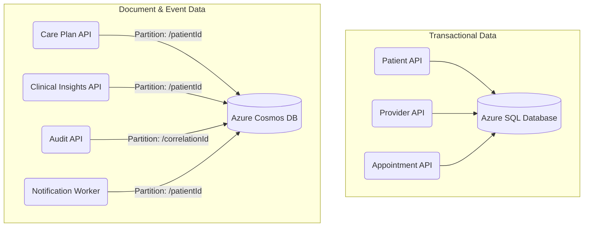

# Azure Data Flow

```mermaid
graph TD
    subgraph "Transactional Data"
        SQL[(Azure SQL Database)]
        PatAPI(Patient API) --> SQL
        ProvAPI(Provider API) --> SQL
        ApptAPI(Appointment API) --> SQL
    end
    
    subgraph "Document & Event Data"
        Cosmos[(Azure Cosmos DB)]
        CareAPI(Care Plan API) --> |Partition: /patientId| Cosmos
        ClinAPI(Clinical Insights API) --> |Partition: /patientId| Cosmos
        AudAPI(Audit API) --> |Partition: /correlationId| Cosmos
        NotWorker(Notification Worker) --> |Partition: /patientId| Cosmos
    end
```
