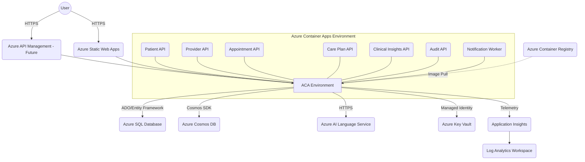

# Azure Deployment Architecture

```mermaid
graph TD
    User((User)) -->|HTTPS| ASWA(Azure Static Web Apps)
    User -->|HTTPS| API_Gateway(Azure API Management - Future)
    
    API_Gateway --> ACA_Env
    ASWA --> ACA_Env
    
    subgraph "Azure Container Apps Environment"
        ACA_Env[ACA Environment]
        PatAPI(Patient API)
        ProvAPI(Provider API)
        ApptAPI(Appointment API)
        CareAPI(Care Plan API)
        ClinAPI(Clinical Insights API)
        AudAPI(Audit API)
        NotWorker(Notification Worker)
        
        PatAPI --- ACA_Env
        ProvAPI --- ACA_Env
        ApptAPI --- ACA_Env
        CareAPI --- ACA_Env
        ClinAPI --- ACA_Env
        AudAPI --- ACA_Env
        NotWorker --- ACA_Env
    end
    
    ACA_Env --> |ADO/Entity Framework| SQL(Azure SQL Database)
    ACA_Env --> |Cosmos SDK| Cosmos(Azure Cosmos DB)
    ACA_Env --> |HTTPS| AI(Azure AI Language Service)
    
    ACA_Env --> |Managed Identity| KV(Azure Key Vault)
    ACA_Env --> |Telemetry| AppInsights(Application Insights)
    AppInsights --> LAW(Log Analytics Workspace)
    
    ACR(Azure Container Registry) -.->|Image Pull| ACA_Env
```
