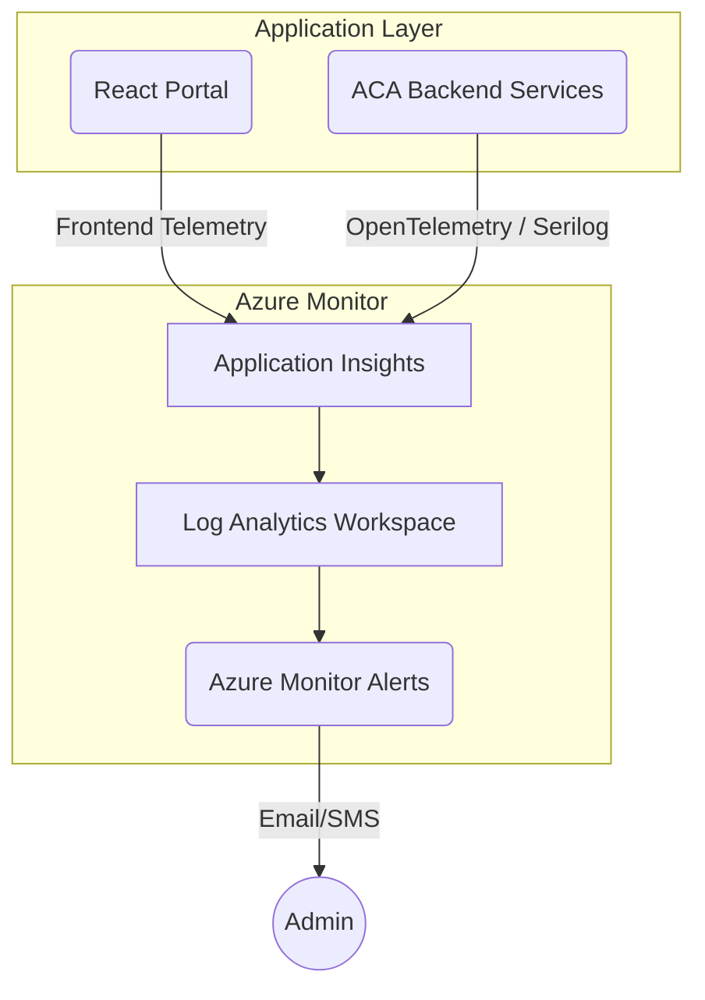

# Azure Observability Flow

```mermaid
graph TD
    subgraph "Application Layer"
        React(React Portal)
        Backend(ACA Backend Services)
    end
    
    subgraph "Azure Monitor"
        AppInsights[Application Insights]
        LAW[Log Analytics Workspace]
        Alerts(Azure Monitor Alerts)
    end
    
    React -->|Frontend Telemetry| AppInsights
    Backend -->|OpenTelemetry / Serilog| AppInsights
    
    AppInsights --> LAW
    LAW --> Alerts
    Alerts -->|Email/SMS| Admin((Admin))
```
