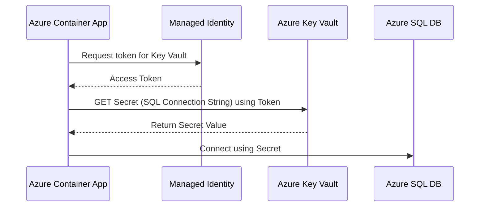

# Azure Secret Management Flow

```mermaid
sequenceDiagram
    participant App as Azure Container App
    participant MI as Managed Identity
    participant KV as Azure Key Vault
    participant SQL as Azure SQL DB
    
    App->>MI: Request token for Key Vault
    MI-->>App: Access Token
    App->>KV: GET Secret (SQL Connection String) using Token
    KV-->>App: Return Secret Value
    App->>SQL: Connect using Secret
```
