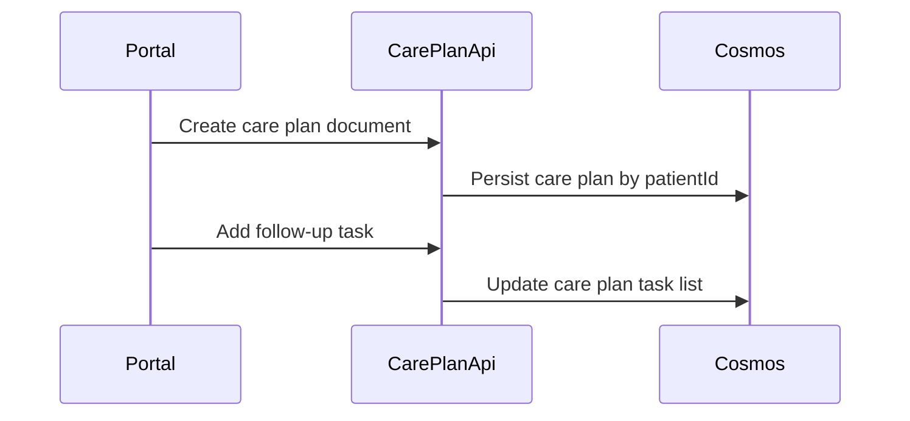

# Care Plan Flow

```mermaid
sequenceDiagram
  participant Portal
  participant CarePlanApi
  participant Cosmos
  Portal->>CarePlanApi: Create care plan document
  CarePlanApi->>Cosmos: Persist care plan by patientId
  Portal->>CarePlanApi: Add follow-up task
  CarePlanApi->>Cosmos: Update care plan task list
```
