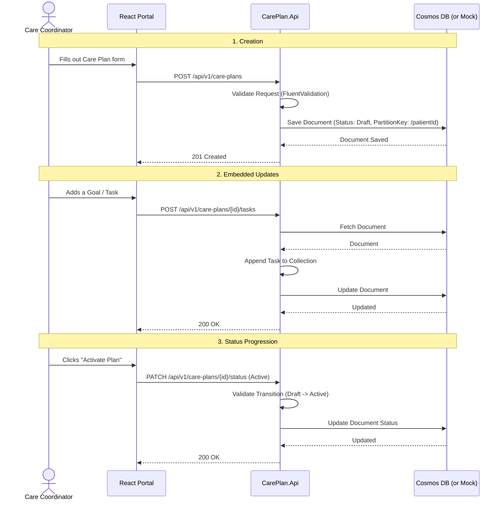

# Care Plan Creation & Management Flow

```mermaid
sequenceDiagram
    actor Coordinator as Care Coordinator
    participant UI as React Portal
    participant API as CarePlan.Api
    participant DB as Cosmos DB (or Mock)

    Note over Coordinator,DB: 1. Creation
    Coordinator->>UI: Fills out Care Plan form
    UI->>API: POST /api/v1/care-plans
    API->>API: Validate Request (FluentValidation)
    API->>DB: Save Document (Status: Draft, PartitionKey: /patientId)
    DB-->>API: Document Saved
    API-->>UI: 201 Created

    Note over Coordinator,DB: 2. Embedded Updates
    Coordinator->>UI: Adds a Goal / Task
    UI->>API: POST /api/v1/care-plans/{id}/tasks
    API->>DB: Fetch Document
    DB-->>API: Document
    API->>API: Append Task to Collection
    API->>DB: Update Document
    DB-->>API: Updated
    API-->>UI: 200 OK

    Note over Coordinator,DB: 3. Status Progression
    Coordinator->>UI: Clicks "Activate Plan"
    UI->>API: PATCH /api/v1/care-plans/{id}/status (Active)
    API->>API: Validate Transition (Draft -> Active)
    API->>DB: Update Document Status
    DB-->>API: Updated
    API-->>UI: 200 OK
```
