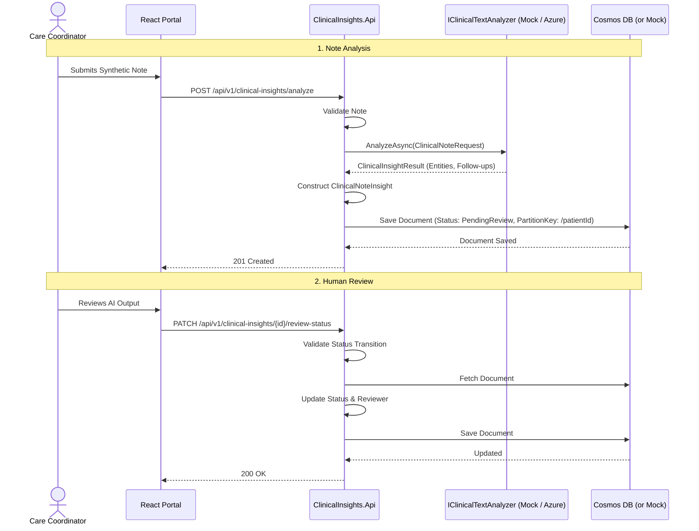

# Clinical Note Insights Flow

```mermaid
sequenceDiagram
    actor User as Care Coordinator
    participant UI as React Portal
    participant API as ClinicalInsights.Api
    participant AI as IClinicalTextAnalyzer (Mock / Azure)
    participant DB as Cosmos DB (or Mock)

    Note over User,DB: 1. Note Analysis
    User->>UI: Submits Synthetic Note
    UI->>API: POST /api/v1/clinical-insights/analyze
    API->>API: Validate Note
    API->>AI: AnalyzeAsync(ClinicalNoteRequest)
    AI-->>API: ClinicalInsightResult (Entities, Follow-ups)
    
    API->>API: Construct ClinicalNoteInsight
    API->>DB: Save Document (Status: PendingReview, PartitionKey: /patientId)
    DB-->>API: Document Saved
    API-->>UI: 201 Created

    Note over User,DB: 2. Human Review
    User->>UI: Reviews AI Output
    UI->>API: PATCH /api/v1/clinical-insights/{id}/review-status
    API->>API: Validate Status Transition
    API->>DB: Fetch Document
    API->>API: Update Status & Reviewer
    API->>DB: Save Document
    DB-->>API: Updated
    API-->>UI: 200 OK
```
