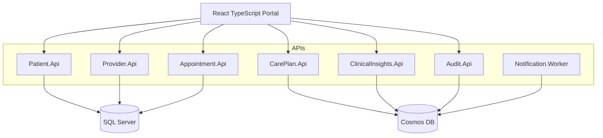

# Container Diagram

```mermaid
flowchart TB
  Portal[React TypeScript Portal]
  subgraph APIs
    Patient[Patient.Api]
    Provider[Provider.Api]
    Appointment[Appointment.Api]
    CarePlan[CarePlan.Api]
    Insights[ClinicalInsights.Api]
    Audit[Audit.Api]
    Notification[Notification.Worker]
  end
  Portal --> Patient
  Portal --> Provider
  Portal --> Appointment
  Portal --> CarePlan
  Portal --> Insights
  Portal --> Audit
  Patient --> SQL[(SQL Server)]
  Provider --> SQL
  Appointment --> SQL
  CarePlan --> Cosmos[(Cosmos DB)]
  Insights --> Cosmos
  Audit --> Cosmos
  Notification --> Cosmos
```
