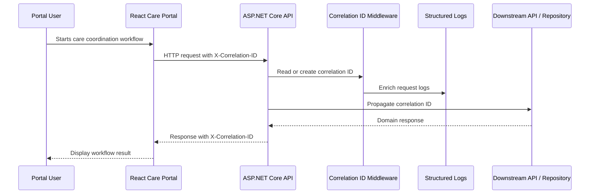

# Correlation ID Flow

```mermaid
sequenceDiagram
  participant User as Portal User
  participant Portal as React Care Portal
  participant Api as ASP.NET Core API
  participant Middleware as Correlation ID Middleware
  participant Logs as Structured Logs
  participant Downstream as Downstream API / Repository

  User->>Portal: Starts care coordination workflow
  Portal->>Api: HTTP request with X-Correlation-ID
  Api->>Middleware: Read or create correlation ID
  Middleware->>Logs: Enrich request logs
  Api->>Downstream: Propagate correlation ID
  Downstream-->>Api: Domain response
  Api-->>Portal: Response with X-Correlation-ID
  Portal-->>User: Display workflow result
```

The correlation ID is operational metadata only. It must not contain patient details, clinical note text, secrets, or sensitive health data.

