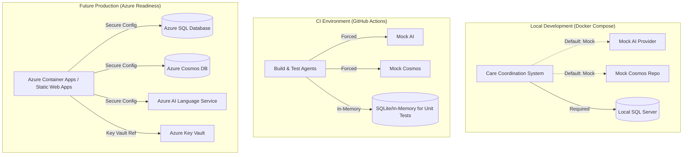

# DevOps Runtime Environment Flow

```mermaid
graph TD
    subgraph "Local Development (Docker Compose)"
        LocalApp[Care Coordination System]
        LocalApp -.->|Default: Mock| MockAI[Mock AI Provider]
        LocalApp -.->|Default: Mock| MockCosmos[Mock Cosmos Repo]
        LocalApp -->|Required| LocalSQL[(Local SQL Server)]
    end
    
    subgraph "CI Environment (GitHub Actions)"
        CIApp[Build & Test Agents]
        CIApp -->|Forced| MockAI_CI[Mock AI]
        CIApp -->|Forced| MockCosmos_CI[Mock Cosmos]
        CIApp -->|In-Memory| SQLite[(SQLite/In-Memory for Unit Tests)]
    end
    
    subgraph "Future Production (Azure Readiness)"
        AzureApp[Azure Container Apps / Static Web Apps]
        AzureApp -->|Secure Config| AzureSQL[(Azure SQL Database)]
        AzureApp -->|Secure Config| AzureCosmos[(Azure Cosmos DB)]
        AzureApp -->|Secure Config| AzureAI[Azure AI Language Service]
        AzureApp -->|Key Vault Ref| AzureKV[Azure Key Vault]
    end
```
