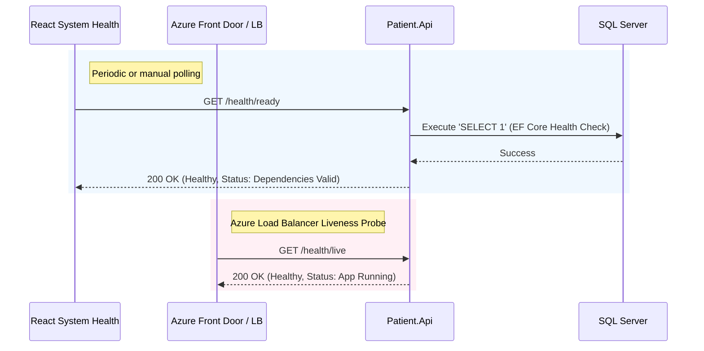

# Health Check Flow

```mermaid
sequenceDiagram
    participant UI as React System Health
    participant LB as Azure Front Door / LB
    participant API as Patient.Api
    participant SQL as SQL Server
    
    rect rgb(240, 248, 255)
    note right of UI: Periodic or manual polling
    UI->>API: GET /health/ready
    API->>SQL: Execute 'SELECT 1' (EF Core Health Check)
    SQL-->>API: Success
    API-->>UI: 200 OK (Healthy, Status: Dependencies Valid)
    end
    
    rect rgb(255, 240, 245)
    note right of LB: Azure Load Balancer Liveness Probe
    LB->>API: GET /health/live
    API-->>LB: 200 OK (Healthy, Status: App Running)
    end
```
