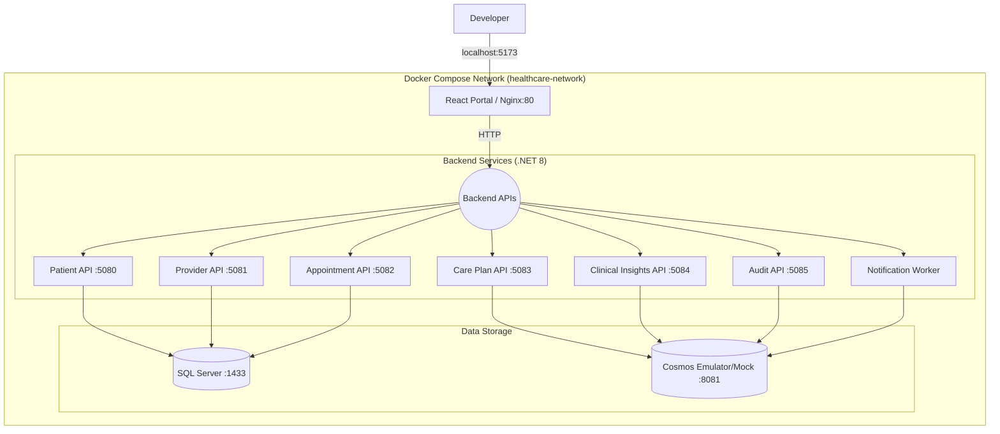

# Local Docker Topology

```mermaid
graph TD
    subgraph "Docker Compose Network (healthcare-network)"
        UI[React Portal / Nginx:80] -->|HTTP| API_GW
        
        subgraph "Backend Services (.NET 8)"
            API_GW((Backend APIs))
            PAT[Patient API :5080]
            PRO[Provider API :5081]
            APP[Appointment API :5082]
            CAR[Care Plan API :5083]
            CLI[Clinical Insights API :5084]
            AUD[Audit API :5085]
            NOT[Notification Worker]
        end
        
        API_GW --> PAT
        API_GW --> PRO
        API_GW --> APP
        API_GW --> CAR
        API_GW --> CLI
        API_GW --> AUD
        API_GW --> NOT

        subgraph "Data Storage"
            SQL[(SQL Server :1433)]
            COS[(Cosmos Emulator/Mock :8081)]
        end
        
        PAT --> SQL
        PRO --> SQL
        APP --> SQL
        
        CAR --> COS
        CLI --> COS
        AUD --> COS
        NOT --> COS
    end
    
    User[Developer] -->|localhost:5173| UI
```
