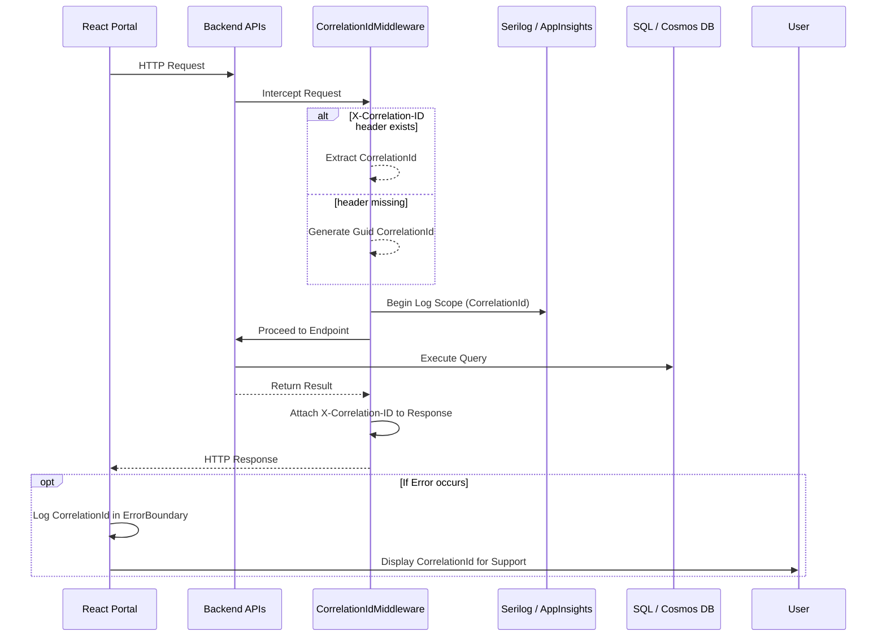

# Observability Flow

```mermaid
sequenceDiagram
    participant UI as React Portal
    participant API as Backend APIs
    participant MW as CorrelationIdMiddleware
    participant LOG as Serilog / AppInsights
    participant DB as SQL / Cosmos DB

    UI->>API: HTTP Request
    API->>MW: Intercept Request
    
    alt X-Correlation-ID header exists
        MW-->>MW: Extract CorrelationId
    else header missing
        MW-->>MW: Generate Guid CorrelationId
    end
    
    MW->>LOG: Begin Log Scope (CorrelationId)
    MW->>API: Proceed to Endpoint
    API->>DB: Execute Query
    API-->>MW: Return Result
    MW->>MW: Attach X-Correlation-ID to Response
    MW-->>UI: HTTP Response
    
    opt If Error occurs
        UI->>UI: Log CorrelationId in ErrorBoundary
        UI->>User: Display CorrelationId for Support
    end
```
