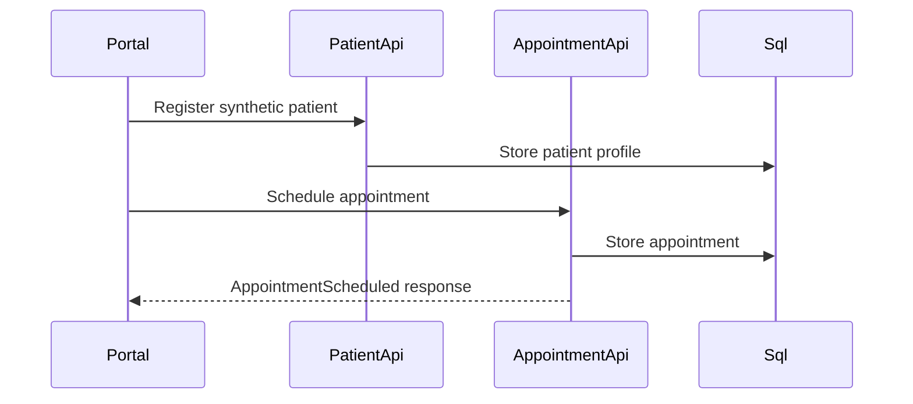

# Patient Appointment Flow

```mermaid
sequenceDiagram
  participant Portal
  participant PatientApi
  participant AppointmentApi
  participant Sql
  Portal->>PatientApi: Register synthetic patient
  PatientApi->>Sql: Store patient profile
  Portal->>AppointmentApi: Schedule appointment
  AppointmentApi->>Sql: Store appointment
  AppointmentApi-->>Portal: AppointmentScheduled response
```
