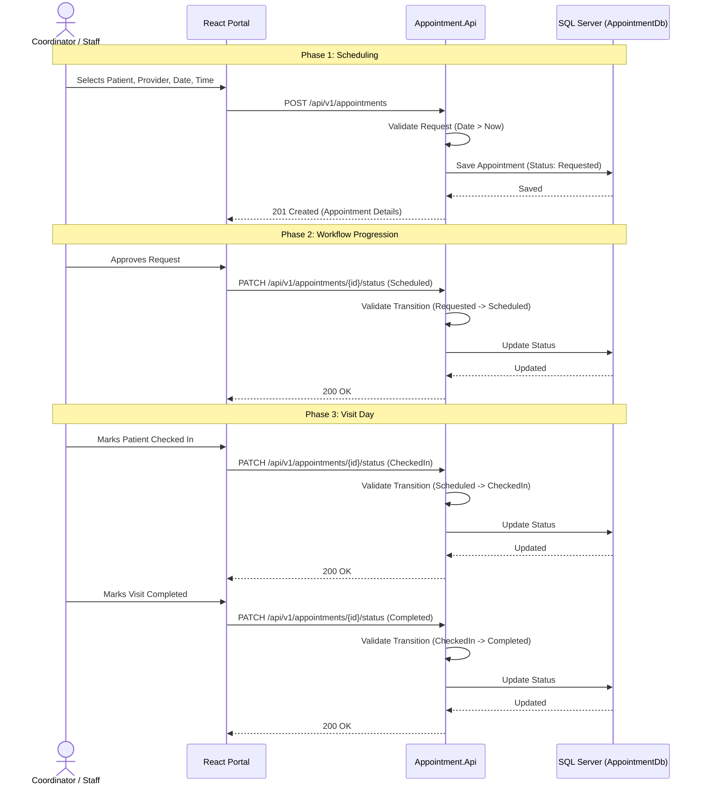

# Patient Appointment Flow

```mermaid
sequenceDiagram
    actor User as Coordinator / Staff
    participant UI as React Portal
    participant API as Appointment.Api
    participant DB as SQL Server (AppointmentDb)

    Note over User,DB: Phase 1: Scheduling
    User->>UI: Selects Patient, Provider, Date, Time
    UI->>API: POST /api/v1/appointments
    API->>API: Validate Request (Date > Now)
    API->>DB: Save Appointment (Status: Requested)
    DB-->>API: Saved
    API-->>UI: 201 Created (Appointment Details)

    Note over User,DB: Phase 2: Workflow Progression
    User->>UI: Approves Request
    UI->>API: PATCH /api/v1/appointments/{id}/status (Scheduled)
    API->>API: Validate Transition (Requested -> Scheduled)
    API->>DB: Update Status
    DB-->>API: Updated
    API-->>UI: 200 OK

    Note over User,DB: Phase 3: Visit Day
    User->>UI: Marks Patient Checked In
    UI->>API: PATCH /api/v1/appointments/{id}/status (CheckedIn)
    API->>API: Validate Transition (Scheduled -> CheckedIn)
    API->>DB: Update Status
    DB-->>API: Updated
    API-->>UI: 200 OK
    
    User->>UI: Marks Visit Completed
    UI->>API: PATCH /api/v1/appointments/{id}/status (Completed)
    API->>API: Validate Transition (CheckedIn -> Completed)
    API->>DB: Update Status
    DB-->>API: Updated
    API-->>UI: 200 OK
```
