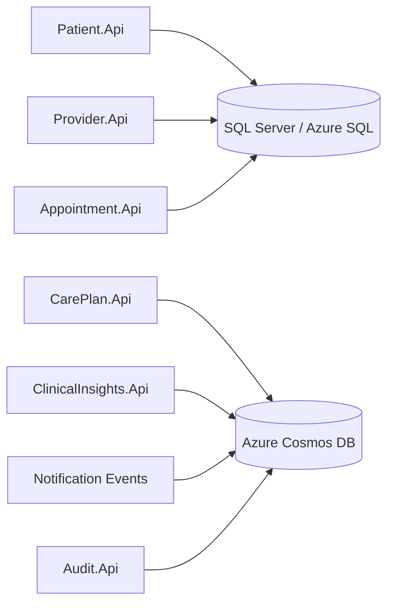

# Polyglot Persistence

```mermaid
flowchart LR
  Patient[Patient.Api] --> SQL[(SQL Server / Azure SQL)]
  Provider[Provider.Api] --> SQL
  Appointment[Appointment.Api] --> SQL
  CarePlan[CarePlan.Api] --> Cosmos[(Azure Cosmos DB)]
  Insights[ClinicalInsights.Api] --> Cosmos
  Notifications[Notification Events] --> Cosmos
  Audit[Audit.Api] --> Cosmos
```
