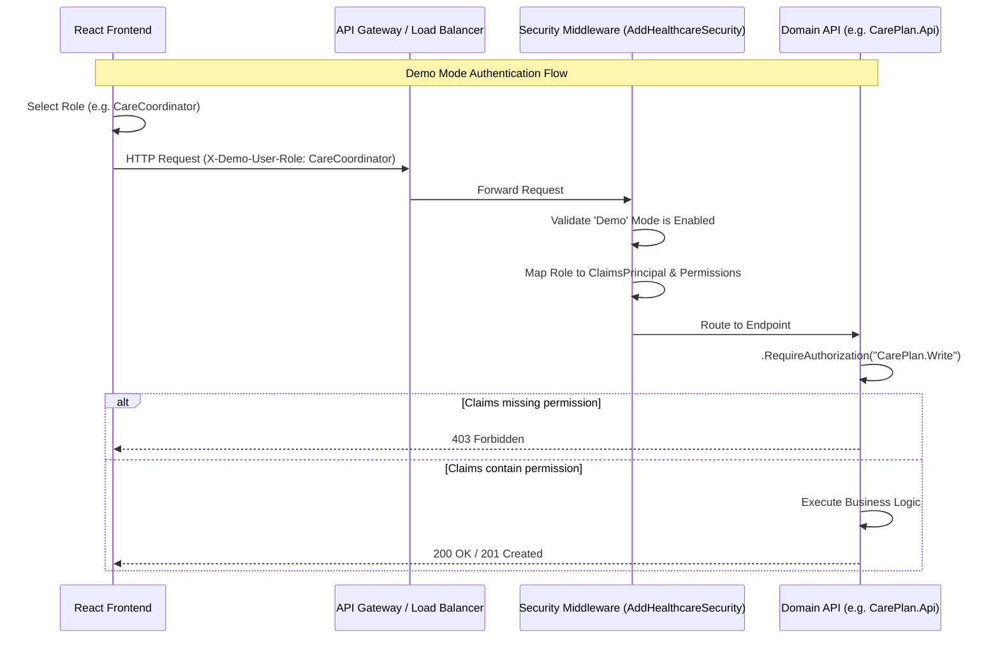

```mermaid
sequenceDiagram
    participant UI as React Frontend
    participant Gateway as API Gateway / Load Balancer
    participant Security as Security Middleware (AddHealthcareSecurity)
    participant API as Domain API (e.g. CarePlan.Api)

    Note over UI,API: Demo Mode Authentication Flow

    UI->>UI: Select Role (e.g. CareCoordinator)
    UI->>Gateway: HTTP Request (X-Demo-User-Role: CareCoordinator)
    Gateway->>Security: Forward Request
    
    Security->>Security: Validate 'Demo' Mode is Enabled
    Security->>Security: Map Role to ClaimsPrincipal & Permissions
    Security->>API: Route to Endpoint
    
    API->>API: .RequireAuthorization("CarePlan.Write")
    
    alt Claims missing permission
        API-->>UI: 403 Forbidden
    else Claims contain permission
        API->>API: Execute Business Logic
        API-->>UI: 200 OK / 201 Created
    end
```
